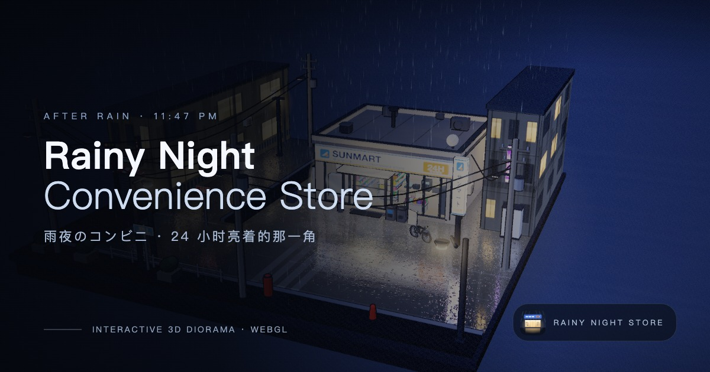
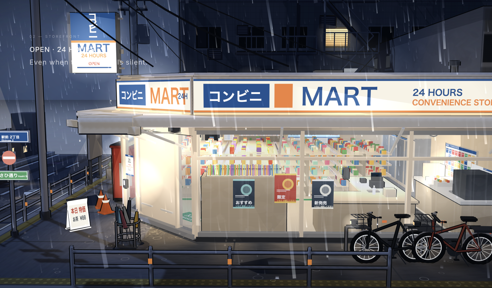
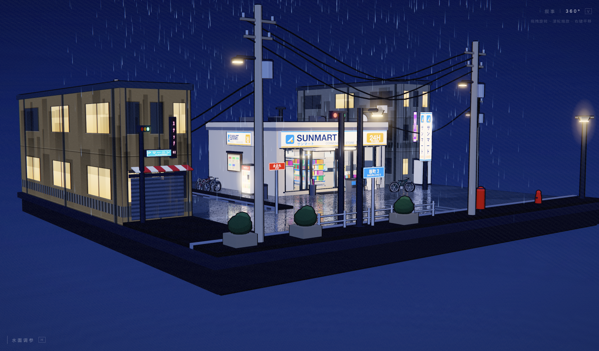
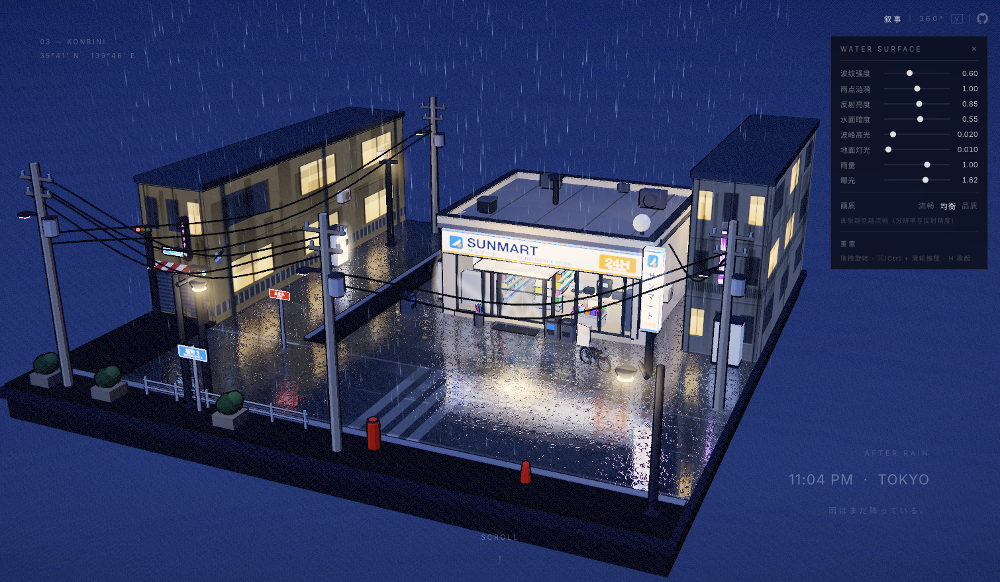
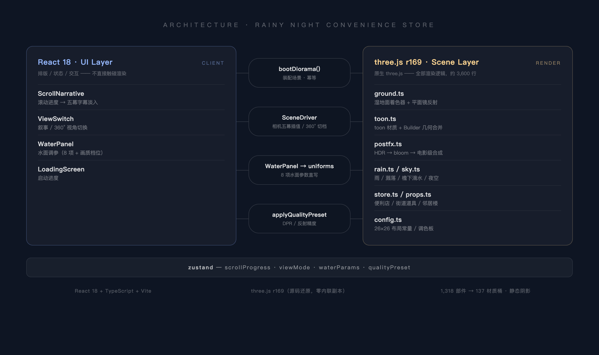

<div align="center">

# 🌧 雨夜便利店街角

**Rainy Night Convenience Store**

_24 小时亮着灯的那一角 —— 细雨、湿漉漉的路面、镜面里的霓虹。_

[](https://www.typescriptlang.org)
[](https://threejs.org)
[](https://react.dev)
[](https://vitejs.dev)
[](#)

**[交互式 3D 微缩景观](#-这是什么) · [滚动五幕叙事](#-五幕两种视角) · [实时水面](#-会呼吸的湿地) · [调参面板](#-实时调参面板)**



_一座 26×26 米的微缩街角：SUNMART 便利店、两栋邻居楼、雨、湿地面的镜面反射 —— 全部实时渲染。_

</div>

---

## 🌧 这是什么

深夜十一点四十七分，东京的某个街角。

便利店的灯还亮着，雨落在湿漉漉的柏油路上，积水把招牌和路灯映成一片模糊的霓虹。
自动门偶尔开合，信号灯按自己的节奏变换，电线在风里轻轻晃。

这是一个**实时渲染的 3D 微缩景观**：滚动页面，相机会依次穿过五幕镜头，
讲述这个街角的一夜；也可以切到 **360° 模式**，自由旋转、缩放、平移，走到任何你想看的位置。

没有任何预制模型 —— 底座、建筑、货架上的每一件商品，都是代码搭出来的。

而这个项目本身，也基本是 **vibe coding** 的产物：从第一行脚手架到水面着色器、
从性能诊断到这份 README，全程用自然语言描述想要的画面与感受，由 AI 完成实现与调试。
人决定"雨夜应该是什么样子"，剩下的交给对话。

## 🎬 五幕 · 两种视角

**叙事模式**：滚动页面，相机以阻尼曲线依次滑过五幕。

| 幕                       | 镜头                                   |
| ------------------------ | -------------------------------------- |
| **01 Arrival**           | 高角度全景，整座微缩街角收进眼底       |
| **02 Storefront**        | 降到街面，正对亮着灯的店门             |
| **03 Through the glass** | 贴近橱窗，透过玻璃看货架与收银台       |
| **04 Street Corner**     | 绕到侧街：信号灯、贩卖机、停着的自行车 |
| **05 Night**             | 拉远、压低 —— 黑夜里一座发光的小盒子   |

**360° 模式**：右上角一键切换（或按 `V`）。拖拽旋转、滚轮缩放、右键平移，
页面滚动自动锁定，字幕淡出，整个模型交到你手里。

<p>
  
  
</p>

## 🌊 会呼吸的湿地

湿地面是整个场景的灵魂，全部由自定义 GLSL 着色器驱动：

- **平面镜反射** —— 每帧将场景对水面镜像渲染一次，倒影是真实的，不是贴图
- **雨点涟漪** —— 双倍频扩散环实时扰动水面法线，涟漪会扭动倒影
- **波纹与湿度** —— 两列慢波让水面永不静止；越湿的地方，反射越亮
- **软饱和光池** —— 八盏灯的光池经过 `lum / (1 + lum)` 软饱和曲线叠加，
  无论面板怎么拉，都绝不会把夜色冲成一片白

## 🎛 实时调参面板

右上角「水面调参」（或按 `H`），八项参数即时生效：

**波纹强度 · 雨点涟漪 · 反射亮度 · 水面暗度 · 波峰高光 · 地面灯光 · 雨量 · 曝光**

外加**画质档位**（流畅 / 均衡 / 清晰 —— 分辨率与反射精度的取舍），选择会被记住。
调参偏好存于 `localStorage`；URL 参数（`?wave=1.4`）优先级最高。



## ⚡ 性能

纯静态站点，构建产物约 **944 KB（gzip 260 KB）**，网页上丝滑流畅 120 fps：

| 手段     | 效果                                                    |
| -------- | ------------------------------------------------------- |
| 几何合并 | 1,318 个部件合并为 **137 个材质桶**，一桶一次 draw call |
| 倒壳描边 | toon 描边以内置顶点属性实现，与几何一同合并             |
| 静态阴影 | 2048² 阴影贴图只烘焙一次（场景无实时阴影需求）          |
| 平面反射 | 反射目标上限随画质档位缩放（384²–896²）                 |
| MSAA 2×  | 从 4× 下调 —— fill-rate 受限场景的最大单项收益          |
| 画质档位 | 流畅 / 均衡 / 清晰，DPR 与反射精度三档可切              |

完整诊断过程见 **[docs/performance-report.md](docs/performance-report.md)**。

## 🧱 技术架构

<div align="center">

</div>

- **UI 层**（React 18）：叙事字幕、视角切换、调参面板、Loading —— 只做排版与状态
- **场景层**（原生 three.js r169，9 个模块约 3,600 行）：全部渲染逻辑，经 `bootDiorama()` 装配，通过 `window.__DIORAMA` 暴露调试句柄
- **桥接**：`SceneDriver` 每帧把滚动进度翻译成相机位姿；`WaterPanel` 把滑块写进 uniform；`zustand` 承载滚动进度 / 视角模式 / 水面参数


## 🚀 快速开始

```bash
git clone https://github.com/xiaodye/rainy-night-konbini
cd rainy-night-konbini
pnpm install
pnpm dev           # 开发服务器（首次预构建约 20s，属正常）
```

```bash
pnpm build         # 生产构建（~944 KB / gzip 260 KB）
pnpm preview       # 本地预览构建产物
```

> 性能对比请用构建产物（`pnpm dev` 有 HMR 与未压缩代码的开销）。

## 🔧 调试参数

全部参数通过 URL 生效，可直接组合排查或截图：

| 类别 | 参数                                                                 |
| ---- | -------------------------------------------------------------------- |
| 水面 | `?wave= ?rip= ?refl= ?dark= ?spark= ?pool= ?rain= ?expo=`            |
| 渲染 | `?msaa=0\|2\|4` · `?rtsize=512` · `?nopost` · `?dbgr=1`              |
| 相机 | `?az=&el=&d=&tx=&ty=&tz=`（球坐标机位）· `?t=8`（冻结时间）          |
| 视图 | `?nopanel` · `?debug=refl`（反射通道可视化）· `?skipintro` · `?door` |

例如 `?pool=0.1&t=8&az=23&el=21&d=47`：冻结在第 8 秒、固定机位、半强光池。

## 📁 目录结构

```text
├── index.html                     入口（SEO / 图标声明 / noscript 兜底）
├── public/                        图标 / OG 封面 / PWA 清单
├── scripts/
│   └── extract-diorama-modules.py bundle → 模块的转换脚本
├── src/
│   ├── main.tsx                   React 入口
│   ├── App.tsx                    组件编排
│   ├── scene/
│   │   ├── SceneDriver.tsx        相机驱动（五幕插值 / 360° / 画质）
│   │   ├── keyframes.ts           五幕球坐标机位
│   │   └── diorama/               ★ 场景源码（还原自 bundle）
│   │       ├── index.ts           bootDiorama() 装配 + 主循环
│   │       ├── adapter.ts         与 React 的类型化接口
│   │       ├── config.ts          布局常量 / 调色板
│   │       ├── toon.ts            toon 材质 + Builder 几何合并
│   │       ├── ground.ts          湿地面着色器 + 平面镜反射
│   │       ├── postfx.ts          HDR → bloom → 电影级合成
│   │       ├── rain.ts / sky.ts   雨 / 天空
│   │       ├── props.ts / store.ts 道具 / 便利店
│   ├── narrative/                 五幕字幕 / Loading
│   ├── ui/                        视角切换 / 水面调参面板
│   └── state/                     zustand（滚动进度 / 视角 / 参数）
├── docs/                          性能报告 / 源码还原说明
├── reference/                     上游 demo 留档与升级指南
└── _legacy/                       原始 bundle 归档（回退用）
```

<div align="center">

_雨还在下。便利店还亮着。_

</div>
